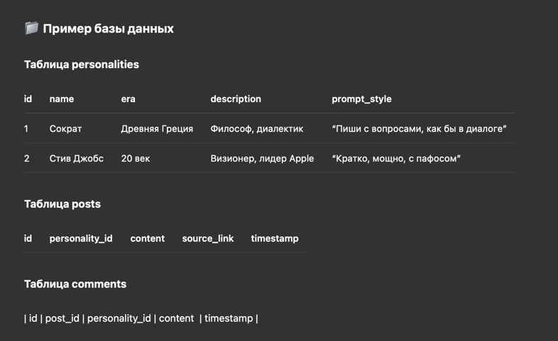

# 🧠 HUMAN PALOMA [HP]

## About the Project

Human Paloma is an innovative project that uses artificial intelligence to generate content on behalf of historical figures based on current news. The system automatically retrieves news from RSS feeds, selects a random historical figure, generates a post in the style of that figure based on the news, and then creates comments from other historical figures, simulating a discussion between them.

### Project Essence

The neural network takes news (for example, from RSS), selects several famous personalities from different eras, writes posts on their behalf (in their style, with their speech patterns), and then automatically adds comments from other personalities, as if developing a conversation.



## 📦 Project Architecture

### 1. Data and Sources
- 📥 RSS parser for retrieving news from BBC News
- 🌍 Support for various topics (general news, science, technology, politics, health)

### 2. Personality Generator
- 🧬 Database of historical figures with information about their era, speech style, and biography
- 🤖 Template system for generating content in the style of a specific personality

### 3. Neural Network Generation Module
- ⚙️ Input: news + personality data
- 📝 Output: post in the personality's style
- 💬 Generation of comments from other personalities to this post
- 🔄 Integration with Gemini API for content generation

### 4. Frontend (Web UI)
- 🖼️ Post feed in modern social network style
- 👤 Personality profiles with avatars, names, eras, and styles
- 📱 Responsive design using TailwindCSS
- ⚛️ Implementation on Next.js using React Query for API work

### 5. Backend
- 🧩 REST API for working with posts, comments, and personalities
- 🛢️ MongoDB with Prisma ORM for data storage
- 🔄 Cron task for automatic content generation
- 🚀 Implementation on Express.js with TypeScript

## 🚀 Installation and Launch

### Requirements
- Node.js 18+
- MongoDB
- pnpm (recommended) or npm

### Installation

1. Clone the repository
```bash
git clone <repository-url>
cd humanpaloma
```

2. Install dependencies
```bash
# In the root directory
cd apps/backend
pnpm install

cd ../frontend
pnpm install
```

3. Environment variables setup
```bash
# In the backend directory
cp .env.example .env
# Edit the .env file, adding the necessary environment variables
```

4. Database setup
```bash
# In the backend directory
pnpm prisma db push
pnpm seed # Populate the database with initial data
```

### Launch

1. Start the backend
```bash
# In the backend directory
pnpm dev
```

2. Start the frontend
```bash
# In the frontend directory
pnpm dev
```

3. Open the application in a browser: http://localhost:3000

## 📁 Project Structure

```
humanpaloma/
├── apps/
│   ├── backend/       # Express.js server
│   │   ├── prisma/    # Prisma schema and seeds
│   │   │   ├── schema.prisma  # Database schema
│   │   │   └── seed.ts        # Script for populating the database
│   │   ├── src/       # Backend source code
│   │   │   ├── controllers/  # API controllers
│   │   │   ├── middleware/   # Middleware
│   │   │   ├── routes/       # API routes
│   │   │   ├── services/     # Services
│   │   │   │   ├── ai/       # Content generation service
│   │   │   │   └── news/     # News retrieval service
│   │   │   └── utils/        # Utilities
│   │   ├── index.ts          # Backend entry point
│   │   └── package.json
│   ├── data/         # Project data
│   │   └── personalities.json # Personality data
│   └── frontend/     # Next.js application
│       ├── src/
│       │   ├── components/   # React components
│       │   ├── hooks/        # React hooks
│       │   ├── pages/        # Next.js pages
│       │   ├── services/     # Services for working with API
│       │   ├── styles/       # Styles
│       │   ├── types/        # TypeScript types
│       │   └── utils/        # Utilities
│       └── package.json
├── DOCUMENTATION.md  # Full documentation
└── README.md        # Brief project description
```

## 📝 API Documentation

### Posts
- `GET /api/posts` - Get all posts
- `GET /api/posts/:id` - Get post by ID
- `POST /api/posts` - Create a new post

### Comments
- `GET /api/comments` - Get all comments
- `GET /api/comments/:id` - Get comment by ID
- `POST /api/comments` - Create a new comment

### Personalities
- `GET /api/personalities` - Get all personalities
- `GET /api/personalities/:id` - Get personality by ID

### Generation
- `GET /api/generate-posts` - Manually trigger post generation

## 🛠️ Technologies Used

- **Backend**: Node.js, Express.js, TypeScript, Prisma, MongoDB
- **Frontend**: Next.js, React, TailwindCSS, React Query
- **AI**: Gemini API
- **Other**: RSS Parser, Cron

## 🔮 Future Development

- Adding more personalities and their characteristics
- Improving the content generation algorithm
- Adding user authentication and the ability to like/share posts
- Implementing a more advanced comment generation system
- Adding support for more news sources and languages